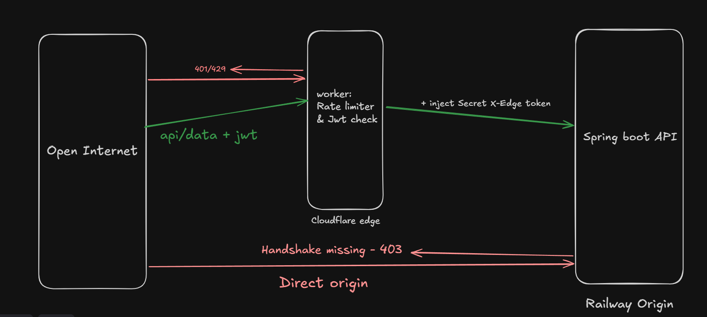

# thresh: Zero-Trust Edge Gateway

An architectural pattern offloading API Authentication (JWT) and Rate Limiting the CDN Edge (Cloudflare Workers), while locking down the Spring Boot origin behind a zero-trust handshake.

built to solve a specific infrastructure problem: preventing unauthenticated or malicious traffic from ever waking up the backend server, allocating threads, or burning database connections.

## test it
**Edge Gateway URL:** `https://thresh-cf.kunaltripathi2153.workers.dev`
> : Hit the `/api/token` route to generate a temporary 5-minute JWT, then use that token as a Bearer header to test `/api/protected`!*

## Arch



Traffic traverses two discrete systems perfectly isolated from one another:

### 1. The Edge Gateway (`thresh-cf`)
A serverless Cloudflare Worker acting as the frontline filter.
- Intercepts all traffic, mathematically verifying JWT signatures (HS256) via the `jose` library without touching a database.
- Enforces a native Cloudflare Rate Limit (10 requests / 60 seconds).
- Drops bad traffic instantly (401/429) at the edge, saving origin compute.
- Extracts `sub` from the JWT payload and injects it as an `X-User-Id` header.
- Forwards surviving traffic to the origin, securing it with a heavily guarded `X-Edge-Token` header.

### 2. The Origin Server (`thresh-backend`)
A standard Spring Boot 3 Java backend that is 100% blind to the open internet.
- Utilizes a `OncePerRequestFilter` to forcefully drop any incoming request missing the exact `X-Edge-Token` handshake (403 Forbidden).
- Completely ignores actual JWT parsing or rate-limiting.
- Safely processes business logic assuming all incoming traffic is pre-authenticated, rate-limited, and perfectly sanitized.

## File Structure

- `/thresh-cf` - The Cloudflare Worker edge gateway (TypeScript).
- `/thresh-backend` - The Spring Boot origin server (Java 17, Gradle).
- `threshPostmanCollection.json` - Integration tests targeting the specific edge drop-offs and origin boundaries.

## Running Locally

**Backend Setup**
```bash
cd thresh-backend
./gradlew bootRun
```
*Note: The backend listens on 8080. You can define the `edge.secret` property in `application.properties`.*

**Edge Setup**
```bash
cd thresh-cf
npm install
npm run dev
```
*Note: For local development, create a `.dev.vars` file setting `JWT_SECRET` and `EDGE_SECRET`.*

## Validating the Boundaries

Import `threshPostmanCollection.json` into Postman to verify the exact failure states:
1. **Valid Token:** Passes Edge, Passes Origin (200 OK)
2. **Missing/Forged JWT:** Dropped at Edge (401 Unauthorized)
3. **Rate Limit Hit:** Dropped at Edge (429 Too Many Requests)
4. **Direct Origin Attack (Bypassing Edge):** Instantly dropped at Origin (403 Forbidden)
